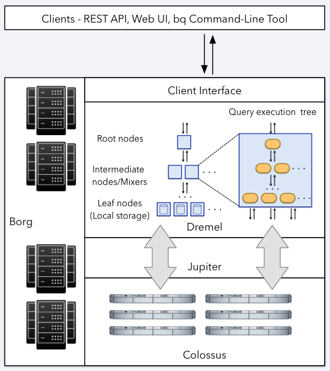
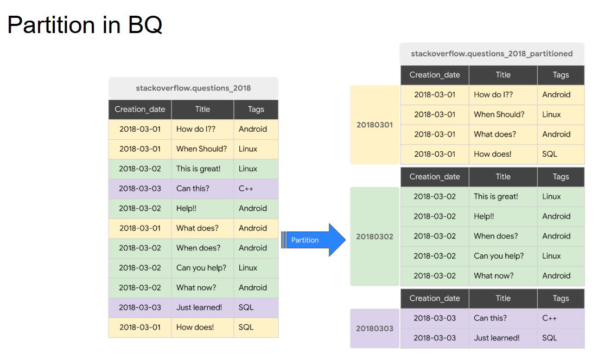
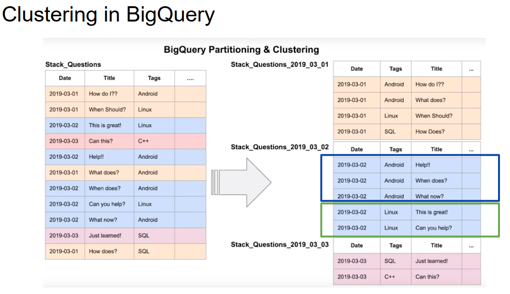

# Semana 3

## 1. Comandos básicos

Descargar archivo

```bash
wget <URL>
```

```bash
curl -o <archivo_destino>  <URL>
```

Descomprimir archivo

```bash
gunzip <archivo>.gz
```

Ver contenido archivo

```bash
less <archivo>

head -n 25 <archivo>
```

Mover archivo

```bash
mv <origen> <destino>
```

Eliminr archivo

```bash
rm <archivo>
```

Renombrar archivo

```bash
mv <nombre_archivo_actual> <nombre_archivo_nuevo>
```


## 2. Entornos de desarrollo

Crear entorno e instalar dependencias

```bash
pipenv --python 3.12
```

```bash
pipenv install pandas
```


```bash
pipenv install --dev notebook
```

## 3. BigQuery


[](https://www.youtube.com/watch?v=BH_7_zVk5oM)


### Conceptos basicos sobre BigQuery:

[](https://www.youtube.com/watch?v=d3MDxC_iuaw)

[](https://www.youtube.com/watch?v=StEuT-pntZQ)

[](https://www.youtube.com/watch?v=Davhwj_8b8Q)

[](https://www.youtube.com/watch?v=Abzj-Vyhi74)


###  Conceptos intermedios sobre BigQuery:

[](https://www.youtube.com/watch?v=AlKKZuULIxM)

[](https://www.youtube.com/watch?v=ZTpOAmJWhAk)

[](https://www.youtube.com/watch?v=AYmoUQ_lyeg&list=PLIivdWyY5sqLAbIdmcMwsxWg-w8Px34MS&index=10&t=8s)

[](https://www.youtube.com/watch?v=8fNnqshJ2Nw&hl=es-419)

[](https://www.youtube.com/watch?v=jBfx1K3-97k)

[](https://www.youtube.com/watch?v=c3dtgLWRycs)


### La arquitectura de Google BigQuery:

[](https://panoply.io/data-warehouse-guide/bigquery-architecture/)

### Usando SQL en BigQuery:

**Consultar tabla pública disponible**

```sql
SELECT station_id, name FROM
    bigquery-public-data.new_york_citibike.citibike_stations
LIMIT 100;
```

**Crear una tabla externa que haga referencia a la ruta de gcs**
```sql
CREATE OR REPLACE EXTERNAL TABLE `taxi-rides-ny.nytaxi.external_yellow_tripdata`
OPTIONS (
  format = 'CSV',
  uris = ['gs://nyc-tl-data/trip data/yellow_tripdata_2019-*.csv', 'gs://nyc-tl-data/trip data/yellow_tripdata_2020-*.csv']
);
```

**Consulta los datos del viaje**
```sql
SELECT * FROM taxi-rides-ny.nytaxi.external_yellow_tripdata limit 10;
```

**Crear una tabla no particionada a partir de una tabla externa**
```sql
CREATE OR REPLACE TABLE taxi-rides-ny.nytaxi.yellow_tripdata_non_partitioned AS
SELECT * FROM taxi-rides-ny.nytaxi.external_yellow_tripdata;
```

**Crear una tabla particionada a partir de una tabla externa**



```sql
CREATE OR REPLACE TABLE taxi-rides-ny.nytaxi.yellow_tripdata_partitioned
PARTITION BY
  DATE(tpep_pickup_datetime) AS
SELECT * FROM taxi-rides-ny.nytaxi.external_yellow_tripdata;
```

**Impacto de la partición**

Escaneando 1,6 GB de datos
```sql
SELECT DISTINCT(VendorID)
FROM taxi-rides-ny.nytaxi.yellow_tripdata_non_partitioned
WHERE DATE(tpep_pickup_datetime) BETWEEN '2019-06-01' AND '2019-06-30';
```

Escaneando 106 MB de datos
```sql
SELECT DISTINCT(VendorID)
FROM taxi-rides-ny.nytaxi.yellow_tripdata_partitioned
WHERE DATE(tpep_pickup_datetime) BETWEEN '2019-06-01' AND '2019-06-30';
```

**Veamos las particiones.**
```sql
SELECT table_name, partition_id, total_rows
FROM `nytaxi.INFORMATION_SCHEMA.PARTITIONS`
WHERE table_name = 'yellow_tripdata_partitioned'
ORDER BY total_rows DESC;
```

**Creación de una partición y una tabla de clúster**



```sql
CREATE OR REPLACE TABLE taxi-rides-ny.nytaxi.yellow_tripdata_partitioned_clustered
PARTITION BY DATE(tpep_pickup_datetime)
CLUSTER BY VendorID AS
SELECT * FROM taxi-rides-ny.nytaxi.external_yellow_tripdata;
```

**La consulta escanea 1,1 GB**
```sql
SELECT count(*) as trips
FROM taxi-rides-ny.nytaxi.yellow_tripdata_partitioned
WHERE DATE(tpep_pickup_datetime) BETWEEN '2019-06-01' AND '2020-12-31'
  AND VendorID=1;
```

**La consulta escanea 864.5 MB**
```sql
SELECT count(*) as trips
FROM taxi-rides-ny.nytaxi.yellow_tripdata_partitioned_clustered
WHERE DATE(tpep_pickup_datetime) BETWEEN '2019-06-01' AND '2020-12-31'
  AND VendorID=1;
```


###  Fuentes y Documentación

Si deseas profundizar más, consulta estos recursos:

- *[Data Engineering Zoomcamp](https://github.com/DataTalksClub/data-engineering-zoomcamp/tree/main)*
- *[TLC Trip Record Data](https://www.nyc.gov/site/tlc/about/tlc-trip-record-data.page)*
- *[Descripción general de BigQuery](https://cloud.google.com/bigquery/docs/introduction?hl=es-419)*
- *[Habilita la zona de pruebas de BigQuery](https://cloud.google.com/bigquery/docs/sandbox?utm_source=youtube&utm_medium=Unpaidsocial&utm_campaign=ore-20200513-Using-Sandbox&hl=es-419)*
- *[Conjuntos de datos públicos de BigQuery](https://cloud.google.com/bigquery/public-data?hl=es-419)*
- *[Introducción a las tablas](https://cloud.google.com/bigquery/docs/tables-intro?hl=es-419&source=post_page-----b08d72ad23ae--------------------------------)*
- *[Crea y usa tablas](https://cloud.google.com/bigquery/docs/tables?hl=es-419&source=post_page-----b08d72ad23ae--------------------------------)*
- *[Crea tablas particionadas](https://cloud.google.com/bigquery/docs/creating-partitioned-tables?hl=es-419)*
- *[Crea y usa tablas agrupadas](https://cloud.google.com/bigquery/docs/creating-clustered-tables?hl=es-419)*


